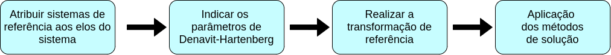
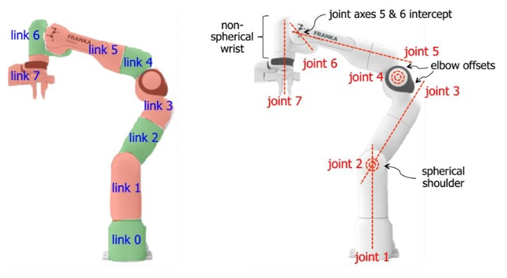

# Introdução

Os robôs manipuladores são muito utilizados nas indústrias devido as suas diversas funcionalidades. Eles são utilizados para o manuseio de materiais, soldagem e montagem, sendo empregados em ambientes de alto risco ou em atividades que exigem precisão, como cirurgias.

A cinemática é o estudo mais básico de como os sistemas mecânicos se comportam. É conhecida como a ciência do movimento e trata do assunto sem considerar as forças que o causam. A cinemática direta tem como entrada os ângulos das juntas e busca calcular a posição e orientação do end-effector do manipulador. Enquanto, a cinemática inversa tem um objetivo mais complexo, que é encontrar os ângulos das juntas dada uma pose para o end-effector.

{:.center}

A cinemática inversa soluciona uma das tarefas ou aplicação mais importantes quando esamos falando de manipuladores ou robôs articulados, que é o de possibilitar o robô atingir as posições e orientações desejadas. Além disso, permite encontrar os valores exatos dos ângulos das juntas que levarão a esta pose, tendo em vista que não há uma relação direta entre a posição do end-effector e uma junta em particular.

<!-- Colocar gif com o wathog -->

O nosso objetivo é compreender os fundamentos da cinemática inversa, com isso, o primeiro passo para aplicar os métodos de solução é atribuir um sistema de referência aos elos do manipulador. E, então atribuir os parâmetros de Denavit-Hartenberg (DH) para o nosso sistema, para então construir matrizes homogêneas e realizar a transformação de referências. Por fim, são aplicados os métodos de solução, no nosso caso iremos abordar o geométrico e o algébrico para então encontrarmos as equações.

{:.center}

 

# Descrições mecânicas

Precisamos entender o comportamento mecânico do robô para sermos capazes de projeta-lo adequadamente. No caso dos manipuladores eles são compostos por diferentes partes. As quais são:

* **Elos**: São os corpos rígidos que ficam localizados entre as juntas;
* **Juntas**: Conectam dois ou mais elos. São responsáveis pelo movimento entre elos que estão conectados;
* **Efetuador**: Fica localizado na parte livre da cadeia de elos do manipulador. É onde são acopladas as ferramentas que o robô utiliza para sua aplicação;
* **Base**: Fica na parte inferior do robô e, é resposável por fixar o robô em alguma estrutura;
* **Actuadores**: Proporcionam os movimentos das juntas do robô;
* **Sensores**: São utilizados para coletar informações sobre o estado interno do robô ou sobre o ambiente.

{:.center}

 

## Graus de liberdade

A mobilidade de um sistema mecânico pode ser classificado de acordo com o número de graus de liberdade que o sistema possui. A fugura mostra um lápis deitado sobre uma folha de papel plana com um sistema x, y de coordenadas. Considerando a posição deste lápis sobre este plano, são necessários 3 parâmetros para definir completamente sua posição na folha: 2 coordenadas lineares (x,y), para definir a posição de qualquer ponto do lápis, e uma coordenada angular ($\theta$), para definir o ângulo do lápis com relação aos eixos. Portanto, este sistema possui 3 graus de liberdade.

Já em um sistema 3D são necessários 6 parâmetros para definir os 6 graus de liberdade. Comumente são utilizadas as coordenadas x, y, z para o movimento de translação e alguma convenção de ângulos, como os ângulos de Euler, para os movimentos de rotação sobre os eixos.

O corpo rígido tem 6 graus de liberdade no espaço, entretanto devido a algumas restrições ocasionadas por suas ligações, pelo menos um dos graus de liberdade é perdido.

## Tipos de juntas

Existem 6 tipos de juntas conhecidas como par inferior, as quais são juntas com superfície de contato.

## URDF

# Descrições espaciais e transformações

## Descrição de uma posição

## Descrição de uma orientação

## Descrição de um sistema de referência

## Transformação homogênea

# Cinemática

## Cinemática Direta

## Notação de Denavit-Hartenberg

## Matriz de Denavit-Hartenberg

## Cinemática Inversa

## Categorias de soluções

## Prática 1 - Resolução questão no Google Colab

## Solucionadores

## MoveIt

## Prática 2 - Simulação no CoppeliaSim

