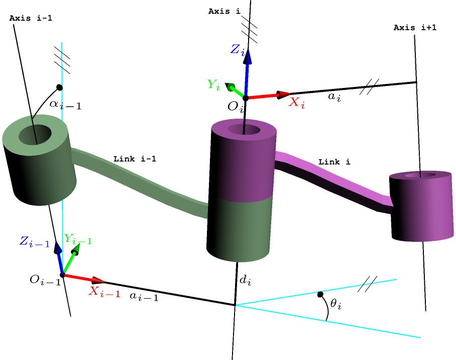

# Introdução

A cinemática é o estudo mais básico de como os sistemas mecânicos se comportam. É conhecida como a ciência do movimento e trata do assunto sem considerar as forças que o causam. 

Os robôs manipuladores são muito utilizados nas indústrias devido as suas diversas funcionalidades como para o manuseio de materiais, soldagem e montagem, sendo empregados em ambientes de alto risco ou em atividades que exigem precisão, como cirurgias. A cinemática, quando falamos de manipuladores, refere-se a todas as propriedades do movimento que sejam geométricas e baseadas no tempo.

### Cinemática Direta vs Cinemática Inversa

A cinemática direta tem como informação os ângulos das juntas e busca calcular a posição e orientação do end-effector do manipulador. Enquanto, a cinemática inversa tem um objetivo mais complexo, que é encontrar os ângulos das juntas dada uma pose (posição e orientação) para o end-effector (efetuador).

{:.center}

### Importância da cinemática Inversa

A cinemática inversa soluciona uma das tarefas ou aplicação mais importantes quando estamos falando de manipuladores ou robôs articulados, que é o de possibilitar o robô atingir as posições e orientações desejadas. Além disso, permite encontrar os valores exatos dos ângulos das juntas que levarão a esta pose, tendo em vista que não há uma relação direta entre a posição do end-effector e uma junta em particular. 

Para mais informações à respeito do planejamento de trajetória de um manipulador veja este [post](https://mhar-vell.github.io/rasc/2021-09-01-doe-aum/) sobre o UR5.

{:.center}

### Metodologia

O nosso objetivo é compreender os fundamentos da cinemática inversa, com isso, o primeiro passo para aplicar os métodos de solução é atribuir um sistema de referência aos elos do manipulador. Para então atribuir os parâmetros de Denavit-Hartenberg (DH) para o sistema e, então construir matrizes homogêneas e realizar a transformação de referências. Por fim, são aplicados os métodos de solução, no nosso caso iremos abordar os métodos geométrico e o algébrico para então encontrarmos as equações.

{:.center}

 

# Descrições mecânicas

Precisamos entender o comportamento mecânico do robô para sermos capazes de projetá-lo adequadamente. No caso dos manipuladores eles são compostos por diferentes partes. As quais são:

* **Elos**: São os corpos rígidos que ficam localizados entre as juntas;
* **Juntas**: Conectam dois ou mais elos. São responsáveis pelo movimento entre elos que estão conectados;
* **Efetuador**: Fica localizado na parte livre da cadeia de elos do manipulador. É onde são acopladas as ferramentas que o robô utiliza para sua aplicação;
* **Base**: Fica na parte inferior do robô e, é resposável por fixar o robô em alguma estrutura;
* **Actuadores**: Proporcionam os movimentos das juntas do robô;
* **Sensores**: São utilizados para coletar informações sobre o estado interno do robô ou sobre o ambiente.

{:.center}

 

## Graus de liberdade

A mobilidade de um sistema mecânico pode ser classificada de acordo com o número de graus de liberdade que o sistema possui. A figura mostra um lápis deitado sobre uma folha de papel plana com um sistema x, y de coordenadas. Considerando a posição deste lápis sobre este plano, são necessários 3 parâmetros para definir completamente sua posição na folha: 2 coordenadas lineares (x,y), para definir a posição de qualquer ponto do lápis, e uma coordenada angular ($\theta$), para definir o ângulo do lápis com relação aos eixos. Portanto, este sistema possui 3 graus de liberdade.

{:.center}

Já em um sistema 3D são necessários 6 parâmetros para definir os 6 graus de liberdade. Comumente são utilizadas as coordenadas x, y, z para o movimento de translação e alguma convenção de ângulos, como os ângulos de Euler, para os movimentos de rotação sobre os eixos.

O corpo rígido tem 6 graus de liberdade no espaço, entretanto devido a algumas restrições ocasionadas por suas ligações, pelo menos um dos graus de liberdade é perdido. Um exemplo disso são os movimentos dos membros de um braço humano que possuem restrições conforme a sua conexão, perdendo assim alguns graus de liberdade na sua movimentação.

{:.center}

## Tipos de juntas

Existem 6 tipos de juntas conhecidas como par inferior, as quais são juntas com superfície de contato.

{:.center}

Os tipos de juntas mais utilizadas nos manipuladores são as juntas de revolução (rotacionais) e as juntas prismáticas (transversais).

## URDF

Uma das aplicações destes conceitos está na implementação do URDF (Unified Robot Description Format), o qual é um arquivo em XML que permite a construção do modelo do seu robô, a partir da descrição do seu funcionamento e estrutura com base nas conexões dos seus elos e juntas, utilizando arquivos CAD para gerar a parte visual.

Este [post](https://mhar-vell.github.io/rasc/2021-07-21-aperea-simulacao/) apresenta mais detalhes a respeito da configuração do URDF.

# Descrições espaciais e transformações

A manipulação robótica envolve peças e ferramentas que fazem parte do ambiente de trabalho do robô e portanto é necessário representar a sua posição e orientação no espaço por meio de coordenadas, assim como considerar um sistema de coordenada de referência para analisar a relação entre as partes do robô e estes objetos.

## Descrição de uma posição

Com relação a posição podemos localizar qualquer ponto no espaço com um vetor posição 3x1 indicando os vetores unitários em cada um dos eixos do sistema de coordenada.

{:.center}

## Descrição de uma orientação

Para descrever a orientação de um ponto utilizamos uma matriz 3x3, denominada de matriz rotacional. Considerando uma coordenada {B} fixa a ponta do manipulador, escrevemos os vetores unitários de seus 3 eixos principais em termos do sistema de coordenadas {A}.

{:.center}

## Descrição de um sistema de referência

O sistema de referências é um conjunto de 4 vetores que fornecem a posição e a orientação. Eles são usados para descrever um sistema de coordenadas em relação a outro. Por convenção são atribuídos alguns nomes e localizações específicos a certos sistemas de referência associados ao robô e ao seu espaço de trabalho, os quais são:

* **Sistema de referência da base**: Está fixado a uma parte imóvel do robô (elo 0);
* **Sistema de referência da estação**: Está fixo em um local relevante para a tarefa;
* **Sistema de referência do punho**: Está fixo ao último elo do manipulador;
* **Sistema de referência da ferramenta**: Está fixado à ponta de qualquer ferramenta que o robô esteja utilizando e quando não é utilizada uma ferramenta este é fixo com a origem entre as pontas dos dedos do robô;
* **Sistema de referência da meta**: Está no local onde o robô deverá alcançar, a sua meta.

{:.center}

## Transformação homogênea

A transformação homogênea corresponde a uma matriz 4x4 que dispõe a rotação e a translação geral na forma de uma única matriz e também é utilizada para descrever os sistemas de referência. Desta forma, é feito o mapeamento de um sistema de referência para outro como um operador em forma de matriz.

A descrição do sistema de referência {B} em relação a {A} é $ _{B}^{A}\textrm{T}$.

# Cinemática

## Cinemática Direta

Conforme mencionado anteriormente, a cinemática direta determina onde o end-effector vai estar posicionado, considerando também sua orientação, se as juntas forem especificadas em uma posição definida. As equações da cinemática direta podem ser definiddas através de uma abordagem sistemática e geral baseada na álgebra linear, utilizando as transformações homogêneas associada aos parâmetros de Denavit- Hartenberg.

## Notação de Denavit-Hartenberg

Os parâmetros de Denavit-Hartenberg ou DH são 4 parâmetros associados a uma convenção particular, a qual relaciona frames de referências aos elos de uma cadeia cinemática.

{:.center}

Esta convenção foi desenvolvida por Jacques Denavit, o qual era doutor em Engenharia mecânica e tinha bastante interesse pela área principalmente em relação a cinemática e a dinêmica. 
E Richard Hartenberg que lecionou na área da engenharia mecânica por cerca de 56 anos e desenvolveu diversas pesquisas na área, o que influenciou o renascimento do interesse de outros pesquisadores por essa área.

{:.center}

Esta notação provê uma metodologia padrão para escrever as equações de um manipulador onde os parâmetros de elo são definidos da seguinte maneira:

$ a_{i} \rightarrow$ a distância de $\hat{Z}_i$ a $\hat{Z}_{i+1}$ medida ao longo de $\hat{X}_i$;

$ \alpha_{i} \rightarrow$ o ângulo de $\hat{Z}_i$ a $\hat{Z}_{i+1}$ medida ao longo de $\hat{X}_i$;

$ d_{i} \rightarrow$ a distância de $\hat{X}_{i-1}$ a $\hat{X}_{i}$ medida ao longo de $\hat{Z}_i$;

$ \theta_{i} \rightarrow$ o ângulo de $\hat{X}_{i-1}$ a $\hat{X}_{i}$ medida ao longo de $\hat{Z}_i$.

{:.center}

## Matriz de Denavit-Hartenberg

## Cinemática Inversa

## Categorias de soluções

## Prática 1 - Resolução questão no Google Colab

## Solucionadores

## MoveIt

## Prática 2 - Simulação no CoppeliaSim

