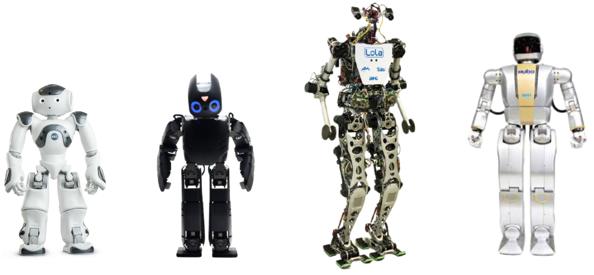

Robôs antropomórficos, também conhecidos como humanoides, possuem uma estrutura que tem como base o corpo humano, com membros e movimentos que visam uma mobilidade que permita ao robô realizar tarefas diversificadas.

Por isso eles são amplamente utilizados em diversas áreas do dia-a-dia, desde interações com humanos até aplicações na área da saúde, bem como em pesquisas acadêmicas, sendo a sua configuração uma das mais eficientes para locomoção em ambientes de difícil navegação.

Com o intuito de auxiliar no desenvolvimento do projeto Walker, que tem como objetivo construir um robô humanoide autônomo de pequeno porte, foi realizado um estudo bibliográfico. Para mais informações sobre este projeto acesse a página do Walker [aqui](https://mhar-vell.github.io/rasc/project-walker/). 

Este estudo do Estado da Arte sobre robôs antropomórficos aborda algumas das aplicações destes robôs e uma visão geral do atual cenário como por exemplo, o robô Ginger, desenvolvido pela CloundMinds, que foi disponibilizado para diversas instalações médicas para ajudar no cuidado de pacientes em meio a pandemia do Coronavírus. 

{:.center}

E, o Digit, que em uma parceria da Agility Robotics com a Ford, está sendo testado em conjunto com um carro autônomo, em um projeto que visa automatizar todo o processo de entrega de mercadorias.

{:.center}

Nesta documentação também é apresentada uma seção sobre as principais características de alguns modelos de robôs humanoides comumente utilizados por pesquisadores para realizar estudos sobre a locomoção bípede. Dentre as referêcias utilizadas nesta pesquisa a maior parte utilizava como modelo o NAO, o DARWIN-OP, o LOLA ou o HUBO.

{:.center}

Também são apresentadas as principais características dos sistemas de percepção e controle dos robôs antropomórficos, assim como da estrutura mecânica, devido a extrema importância destes quesitos no desenvolvimento destes robôs.

Recomendo a leitura deste [post](https://mhar-vell.github.io/rasc/2021-10-06-walker-comparativo/) para mais informações sobre as características e um comparativo entre modelos de robôs antropomórficos.

A pesquisa realizada foi de extrema importância para a análise e o aprendizado sobre os robôs antropomórficos. E, as informações que são apresentadas na documentação são bastante relevantes para o desenvolvimento de novos projetos. O relatório do estudo do Estado da Arte pode ser lido [aqui](https://github.com/Brazilian-Institute-of-Robotics/bir_humanoid_sota/tree/sota).

## Referências

1. CNBC. **Look inside the hospital in China where coronavirus patients were treated by robots.** 2021. <https://www.cnbc.com/2020/03/23/video-hospital-in-china-where-covid-19-patients-treated-by-robots.html>. Accessed: 2021-12-02.
2. SCIENCE, P. **Tesla wants to make humanoid robots. Here’s their competition.** 2021.<https://www.popsci.com/technology/list-of-companies-creating-human-like-robots/>. Accessed: 2021-12-02.
3. ASME. **10 Humanoid Robots of 2020. 2021.** <https://www.asme.org/topics-resources/content/10-humanoid-robots-of-2020>. Accessed: 2021-12-02. 

* * *

<!-- autor -->

<h3 class="post-title">Autor</h3> 

  <table class="table-borderless highlight">
    <thead>
      <tr>
        <th></th>
      </tr>
    </thead>
    <tbody>
      <tr class="font-weight-bolder" style="text-align: center margin-top: 0">
        <td>Juliana Santana</td>
      </tr>
      <tr style="text-align: center" >
        <td style="vertical-align: top"><small>Pesquisadora Jr. do projeto  Engenheira Eletricista.</small></td>
        <td></td>
      </tr>
    </tbody>
  </table>

 

 

