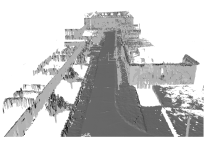
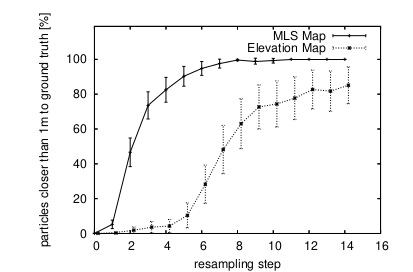

## Monte Carlo Localization in Outdoor Terrains Using Multi-Level Surface Maps

A Localização é  um quesito importante para robótica móvel. Em ambientes internos e controlados, o uso de slam e tags, ajudam o robô a obter dados sobre posição. Porém em ambientes externos nem sempre é possível obter dados da posição usando estas ferramentas. Uma solução para obter dados de robô em ambiente externo é apresentada por [ Rainer K.](https://www.linkedin.com/in/rainer-k%C3%BCmmerle-256b4a15a/?originalSubdomain=de), [Rudolph T.](https://www.linkedin.com/in/rudolph-triebel-82107713/), [Patrick p.](https://www.linkedin.com/in/patrick-pfaff-97a51b9/) e [wolfram B.](https://www.linkedin.com/in/burgard/) no artigo  [Monte Carlo Localization in Outdoor Terrains Using Multi-Level Surface Maps](https://www.researchgate.net/publication/220648287_Monte_Carlo_Localization_in_Outdoor_Terrains_Using_Multi-Level_Surface_Maps) que apresenta a aplicação do Monte carlo localizarion com auxilio de mapas multi niveis e comporar os resultados com uso de mapas de elevação.

Em ambientes abertos, é comum usar o GPS para obter dados sobre a posição dos robôs, porém o sinal deste pode ser prejudicado pela presença de árvores, muros e paredes. Estes elementos podem atuar como obstáculos/anteparo para o sinal do gps. Uma solução para contornar isso, é usar dados do mapa do ambiente juntamente com filtro de partículas para localização, o monte carlo localization.

### Monte Carlo Localizarion

A localização Monte Carlo (MCL) é uma aplicação voltada para sistemas robóticos móveis com objetivo de obter dados sobre a posição e orientação do robô no ambiente. A aplicação é realizada usando um algoritmo  que usa um filtro de partículas de um mapa do ambiente. A estimação da posição e orientação de um robô é feita conforme ele se desloca e coleta dados do ambiente que está presente.  As partículas são estimadas usando filtro bayesiano recursivo usando o conhecimento a priori, modelagem do sistema, com o conhecimento posterior, dados obtidos através de sensoriamento. Parte dos dados que são filtro bayesiano vem do Mapa de multi-níveis.

### Mapa de multi-nivieis

Os mapas que costumam ser usados para a localização são de elevação. Neste, os dados do plano são coletados e bem representados, já as elevações são processadas como um média dos dados verticais. O Mapas de de multi níveis, além representar bem o plano, consegue representar os dados verticais devido ao uso de camada níveis.
#### Mapa de elevação

#### Mapa de multi-nivieis

Os dados geométricos verticais dos mapas multi-níveis são usados para estimar a posição do robô, em outras palavras, o plano vertical e horizontal são usados para a localização do robô. O mapa de multinível também oferece dados sobre a posição do robô quanto ao eixo vertical, o eixo z. Uma outra comparação entre os tipos de mapa, é que o custo computacional do mapa de multi nível só é 10% maior em comparação ao mapa de elevação.

## Resultados 

O uso do monte carlos localization com MLS apresentou uma melhor representação da posição do robô do que com o mapa de elevação, mesmo considerando que um custo computacional. Esta estratégia pode ser uma excelente opção em ambientes externos onde o sinal do GPS é fraco.

## Mapa conceitual

Um mapa conceitual foi realizado para compreender melhor o artigo através de ligações gráficas. As ligações gráficas representam as conexões entre os principais  conceitos que compõem o material.

## conclusão

O Monte Carlo Localization in Outdoor Terrains Using Multi-Level Surface Maps é um excelente artigo. A leitura e a interpretação deste material, juntamente com a montagem do mapa conceitual é essencial para adquirir conhecimentos sobre a robótica móvel e sobre as principais estratégias que a envolvem.