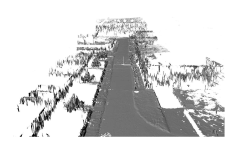

A Localização é  um quesito importante para robótica móvel. Em ambientes internos e controlados, o uso de SLAM e tags, ajudam o robô a obter dados sobre a posição e orientação. Em ambientes externos nem sempre é possível obter dados da posição usando estas ferramentas. Uma solução para realizar a localização em ambientes externos é apresentada por [ Rainer K.](https://www.linkedin.com/in/rainer-k%C3%BCmmerle-256b4a15a/?originalSubdomain=de), [Rudolph T.](https://www.linkedin.com/in/rudolph-triebel-82107713/), [Patrick p.](https://www.linkedin.com/in/patrick-pfaff-97a51b9/) e [wolfram B.](https://www.linkedin.com/in/burgard/) no artigo [Monte Carlo Localization in Outdoor Terrains Using Multi-Level Surface Maps](https://www.researchgate.net/publication/220648287_Monte_Carlo_Localization_in_Outdoor_Terrains_Using_Multi-Level_Surface_Maps) que demonstra a aplicação do Monte Carlo localization com auxílio de mapas multi-níveis e compara os resultados obtidos com mapa de elevação.

Em ambientes externos abertos, é comum usar GPS para obter dados sobre a posição dos robôs, porém o sinal deste pode ser prejudicado pela presença de árvores, muros e paredes. Estes elementos podem atuar como obstáculos para o sinal do gps. Uma solução para contornar isso, é usar dados do mapa do ambiente juntamente com o Monte Carlo Localization.

### Monte Carlo Localization

O Monte Carlo Localization (MCL) é um algortmo destiando a sistemas robóticos móveis com objetivo de obter dados sobre a posição e orientação do robô no ambiente. Este algoritmo  usa um filtro de partículas, para posição e orientação, e um mapa do ambiente para realizar a estimação. As partículas são estimadas usando filtro bayesiano recursivo. Geralmente são usados mapas de elevação para abstecer de dados o Monte Carlo Localization.

### Mapa de Multi-Níveis

Os mapas de elevação são fortemente usados na robótica móvel . Neste, os dados do plano são coletados e bem representados, já as elevações são processadas como um média dos dados verticais. Os Mapas de multi-níveis, além representar bem o plano, consegue representar os dados verticais devido ao uso de representação em camadas.
#### Mapa de Elevação

#### Mapa de Multi-Níveis

Os dados geométricos verticais dos mapas multi-níveis são usados para estimar a posição do robô, em outras palavras, o plano vertical e horizontal servem para calcular a localização. Os mapa de multi-níveis também oferecem dados sobre a posição do robô quanto ao eixo vertical, o eixo z. Um outro comparação detalhe, é que o custo computacional do mapa de multi-nível só é 10% maior em comparação ao mapa de elevação, em outras palavras, há um pequeno aumento no uso de hardware.

## Resultados 

O uso do Monte Carlos Localization com o mapa de multi-nível apresentou uma melhor representação da posição do robô em comparação ao mapa de elevação. Esta estratégia pode ser uma excelente opção em ambientes externos onde o nem sempre o sinal do GPS está disponível.

## Mapa Conceitual

Um mapa conceitual foi realizado para compreender melhor o artigo através de ligações gráficas. As ligações gráficas representam as conexões entre os principais  conceitos que compõem o material.

## conclusão

O Monte Carlo Localization in Outdoor Terrains Using Multi-Level Surface Maps é um excelente artigo. A leitura e a interpretação deste material, juntamente com a montagem do mapa conceitual é válido para adquirir conhecimentos sobre a robótica móvel e sobre as estratégias que a envolvem a localização destes.

 

<!-- autor -->

<h3 class="post-title">Autor</h3> 

  

    <table class="table-borderless highlight">
      <thead>
        <tr>
          <th></th>
        </tr>
      </thead>
      <tbody>
        <tr class="font-weight-bolder" style="text-align: center margin-top: 0">
          <td>Matheus Anselmo</td>
        </tr>
        <tr style="text-align: center" >
          <td style="vertical-align: top"><small>Pesquisador Jr. do projeto  Engenheiro de Controle e Automação.</small></td>
          <td></td>
        </tr>
      </tbody>
    </table>
  

 