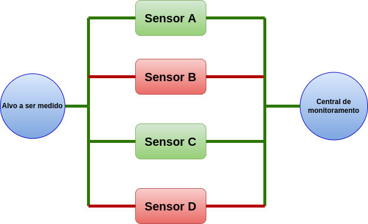
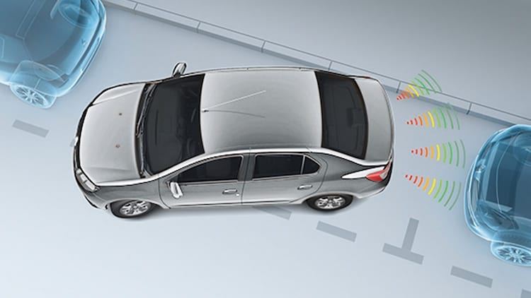
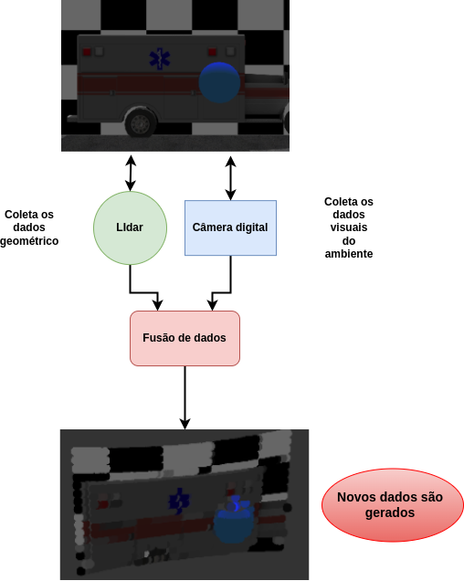

## Fusão de Sensores

Nem sempre um único sensor consegue desempenhar a coleta de dados da forma desejada. E isso acontece por diversas razões: o sensor não consegue cobrir com acuracidade um grande intervalo de dados,  necessidade de haver uma pequena incerteza nas medições e dentre outras. Para atenuar essas dificuldades, técnicas de fusão de sensores, também chamada de fusão de dados, costumam ser aplicadas. O uso de mais de um sensor pode ser dividida em 4 objetivos:
* Aumento da confiabilidade;
* Aumento do tamanho de cobertura de medição;
* Realização de medidas indiretamente;
* Melhoria da qualidade do Sinal;
* Criação de novos dados.

### Aumento da Confiabilidade de Sistemas

Sensores podem ser implementados em sistemas para mensurar  dados que são importantes para a segurança.  Por exemplo, sensores  que são usados para mensurar a velocidade de turbinas de aviões. Os dados que são coletados pelos sensores, são importantes para o copiloto e piloto do avião ter conhecimento sobre a atual dinâmica do veículo aéreo. Porém se apenas há um sensor para uma turbina e este falha, os pilotos passam a não ter informação suficientes para realizar uma viagem segura. Para aumentar a garantia da continuidade da realização das medidas sobre um variável, é comum implementar mais de um sensor sobre o mesmo alvo, caso um sensor falhe, os outros devem continuar realizando as medições.
 
Em sistema, onde há 4 sensores dedicados à medição de um alvo, se dois destes falham  na coleta, os outros podem continuar a enviar os dados corretamente.

{:.center}

### Aumento do Tamanho da Cobertura de Medição

Algumas aplicações exigem mais de um sensor  em razão do tamanho da área e/ou região a ser tratada. Portanto, um conjunto de sensores podem ser usado para expandir a cobertura de medição. Um exemplo bastante comum  é nos sensores de sensoriamento aplicados a automóveis. Normalmente, 4 sensores são alocados na parte traseira do veículo para detectar a presença de outros carros ou paredes. 

### Realização de  medidas indiretamente

 
Uma aplicação que a fusão de sensores pode ser encarregada é a medição de dados indiretamente, ou melhor,  estimação. Ainda não há tecnologia suficiente para realizar a medida da temperatura da cauda de um foguete, ou para medir o desgaste de pneus de carros de Fórmula 1, mas mesmo assim é possível obter uma estimação de como estes dados estão se comportando.
Se é possível obter a medição de alguns sensores de um sistema, a modelagem matemática destes sistemas, com o uso do filtro de Kalman, é possível  estimação destas variáveis, considerando que estas são
 [observáveis](https://en.wikipedia.org/wiki/Observability).

Os Filtros de Kalman são aplicados para realizar a estimação de estados, onde é considerado os dados do sistema real e sistema modelado, e partir do ganho K há um balanceamento entre estados mensurados e estimados. O ganho K é calculado em função da [covariância](https://en.wikipedia.org/wiki/Covariance) dos dados dos sistemas, quanto maior a covariância, menor será o ganho atribuído. 

{:.center}

### Criação de novos dados

Uma aplicação que usa  fusão e que está crescendo nos últimos anos, é a criação de novos dados. Nesta criação, são usados dois, ou mais, dados para obter um novo. Um bom exemplo é a aplicação  de câmera digital juntamente com lidar para criar uma nuvem pontos com as cores dos elementos. O lidar é responsável pela obtenção das nuvens de pontos e a câmera consegue obter dados visuais do ambiente, e assim as cores dos elementos. Com o uso de algoritmos de inteligência artificial, há uma fusão de dados e uma nuvem de pontos que possui dados sobre as cores pode ser gerada.Dois pesquisadores, [Matheus França](https://www.linkedin.com/in/matheus-fran%C3%A7a-b62044150/) e [Tiago Souza](https://github.com/engtpsouza), realizaram esta fusão usando o simulador Gazebo. O resultado é exibido na figura seguinte.

{:.center}

### Aumento da qualidade dos dados

Uma situação comum na robótica é quando apenas um único sensor não consegue mensurar corretamente os dados da odometria. Isso implica bastante na navegação autônoma, já que nesta situação as ações de controles são executadas com dados que não retratam muito bem a dinâmica, e o robô passa a atuar de forma inadequada.
 
Para contornar esse problema, fusão de sensores são utilizados para melhorar a qualidade do sinal. O Filtro de Kalman, assim como sua versão para sistema não lineares, o Filtro de kalman estendido, melhoram a qualidade dos dados e tornam mais próximos dos dados reais, além de estimar dados de variáveis observáveis.
 
A figura abaixo apresenta uma aplicação fusão de sensores, usando Filtro de Kalman, para melhorar os dados da medição da posição. No gráfico, é possível perceber que os dados dos sensores, Pos Sensor e Wheel sensor, estão apresentando uma grande variabilidade, mas os dados filtrados a partir da fusão, filter, apresentam uma certa suavidade.

{:.center}

Este gráfico está presente no [Notebook](https://colab.research.google.com/drive/1G0LTEOHRc8FBg3PAgu8uzaVPgPn1B5gd?usp=sharing) que apresenta uma breve introdução sobre Filtro de Kalman dedicado a fusão de sensores. Também há uma revisão sobre alguns conceitos sobre estatística, caso o leitor já sinta seguro e familiarizado sobre os conceitos, sugiro que pule esta parte.

 
<iframe src ="https://drive.google.com/file/d/1rhzWInXQev4B_oJt1n-9WmxWxP5TmhDy/preview" width='740' height='430' allowfullscreen mozallowfullscreen webkitallowfullscreen></iframe>

---------------------
 

<!-- autor -->

<h3 class="post-title">Autor</h3> 

  

    <table class="table-borderless highlight">
      <thead>
        <tr>
          <th></th>
        </tr>
      </thead>
      <tbody>
        <tr class="font-weight-bolder" style="text-align: center margin-top: 0">
          <td>Matheus Anselmo</td>
        </tr>
        <tr style="text-align: center" >
          <td style="vertical-align: top"><small>Pesquisador Jr. do projeto  Engenheiro de Controle e Automação.</small></td>
          <td></td>
        </tr>
      </tbody>
    </table>
  

 

